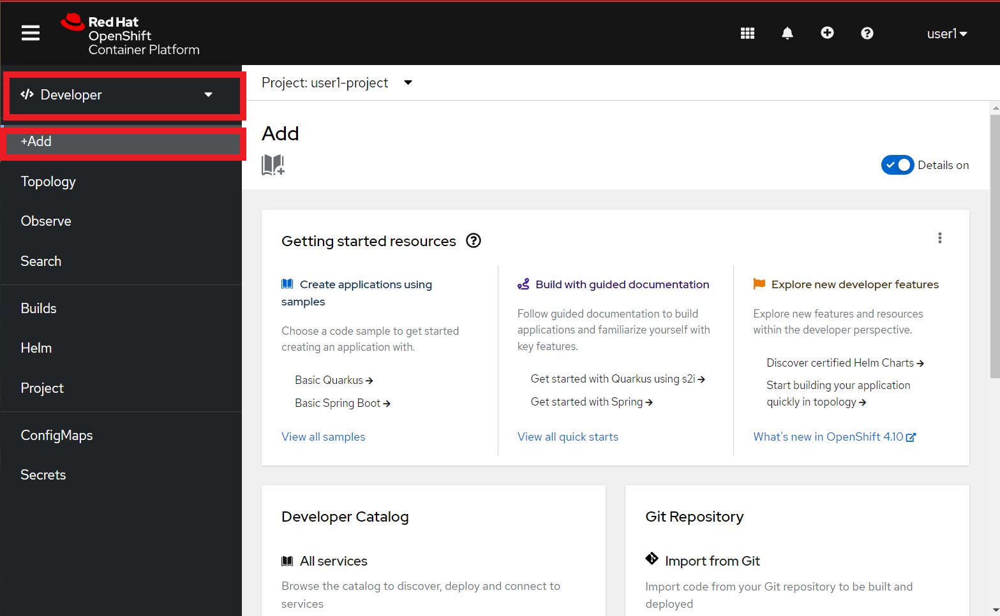
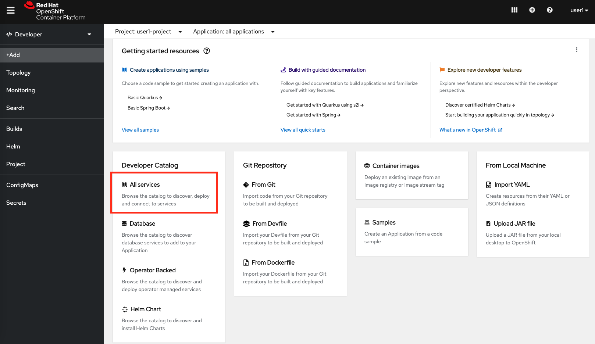
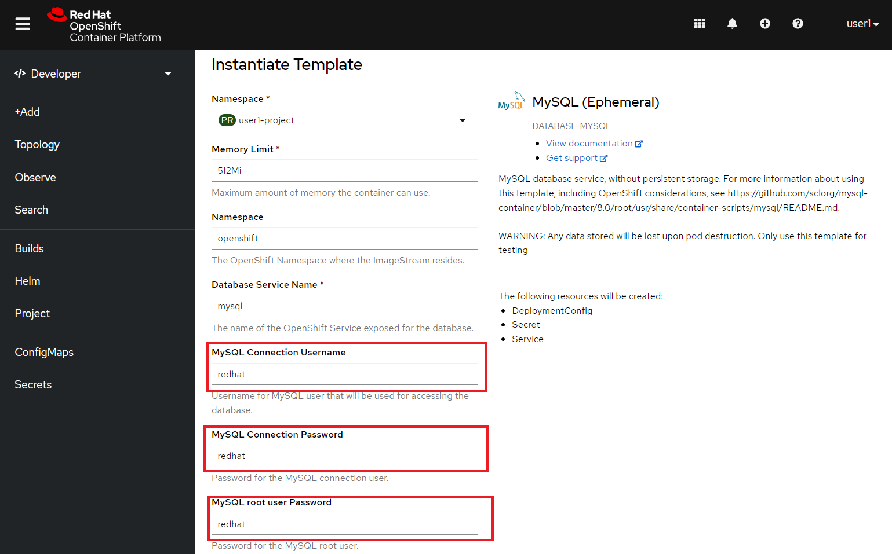
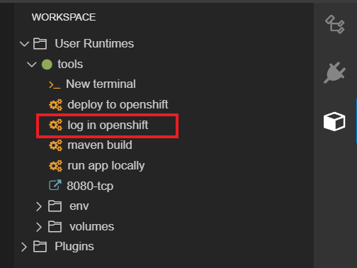
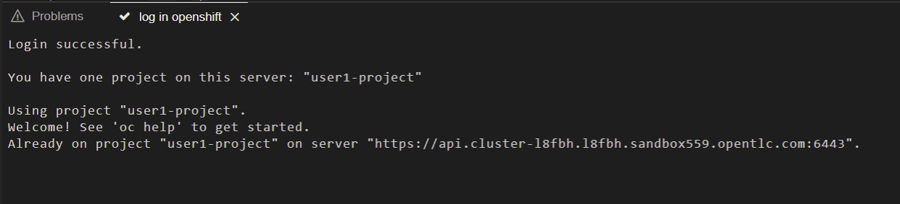

:walkthrough: Publish to Openshift
:codeready-url: {che-url}
:openshift-url: {openshift-host}
:user-password: openshift

= Lab 4 - Publish to OpenShift

Learn how to deploy integrations using the tools available for OpenShift.

There are several ways to deploy an application into OpenShift, the most common are:

- Directly from the git repository using S2I
- From the local machine using binary deployment
- From a Docker image

{empty} +

For this lab we will start with the binary deployment option, uploading the binary directly from the IDE workspace to OpenShift.
For it to work we will need the `oc` client that is installed in the environment.

In the last section you will see how to use S2I to deploy applications, a way to deploy application using git repositories.

[type=walkthroughResource,serviceName=codeready]
.CodeReady Workspaces
****
* link:{codeready-url}[Console, window="_blank"]
* link:https://developers.redhat.com/products/codeready-workspaces/overview[Want to know more about CodeReady Workspaces?, window="_blank"]
****

[type=walkthroughResource,serviceName=openshift]
.OpenShift Console
****
* link:{openshift-url}[Console, window="_blank"]
****

[type=walkthroughResource]
.OpenShift Maven Plugin
****
* link:https://www.eclipse.org/jkube/docs/openshift-maven-plugin[OpenShift Maven Plugin, window="_blank"]
****

[time=5]
== MySQL Database provisioning

First, to work with the MySQL database we have to deploy/provision it.

Go to the link:{openshift-host}[OpenShift Console, window="_blank"].
On the *Developer* view, click on *Add*  on the left menu:

{empty} +

Click on *From Catalog*:

{empty} +

Then look for *mysql* and select the *MySQL (Ephemeral)* option:

image::./images/03.png[]

{empty} +

Click on *Instantiate Template*:

image::./images/04.png[]

{empty} +

Fill out *MySQL Connection Username*, *MySQL Connection Password* and *MySQL root user Password* as *redhat* and then click *Create*:

{empty} +

[type=verification]
Were you able to deploy Mysql?

[time=15]
== Application deployment to OpenShift using Binary Deployment

Before using the `oc` maven plugin, first we need to log in OpenShift.
On the right side panel, click on the `log in openshift` command:

{empty} +

Once the login process is done, you should see a similar message:

{empty} +

Now that you are logged in, on the right panel, click on the `deploy to openshift` command.
This command you build the project locally and push it to OpenShift, where a container image will be created.

{empty} +

The `openshift` maven profile uses the k8s authentication configuration present in the user home.
It also uses a binary deployment, meaning it builds your application binary locally and sends the resulting jar to OpenShift to "wrap" in a container image and deploy it.

After the deployment completes, you will see that the application is using both the AMQ Broker / Kafka and the MySQL database deployed on OpenShift.
All production configuration data is in the `src/main/resources/application-prod.properties` file and Qiuarkus is activating this profile during the deployment.
oc will inject this content inside of the final DeploymentConfig when deploying to OpenShift.

[type=verification]
Were you able to deploy the Application?

