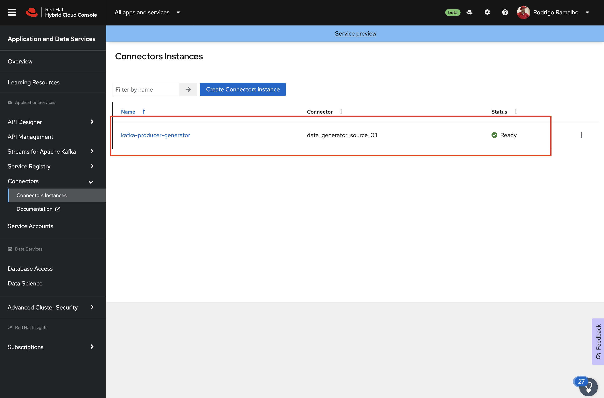

:walkthrough: Red Hat OpenShift Streams for Apache Kafka
:codeready-url: {che-url}
:openshift-url: {openshift-host}
:user-password: openshift

= Lab 5 - Red Hat OpenShift Streams for Apache Kafka

In this lab, we will provision a Kafka cluster using the Red Hat Openshift Streams for Apache Kafka (RHOSAK).

Once the cluster is provisioned, we will use Red Hat Openshift connectors to produce and consume events from the Kafka cluster.

For last, adapt the `Camel quarkus` application to consume and produce JSON events to this cluster.

[time=2]
== Event Driven Architecture Introduction

In an event-driven architecture (EDA), an event notification is generated, and the system captures what happened and waits to respond back.  The application that got the notification might either reply immediately or wait until the status changes.

Event Driven Architecture allows for more flexible, scalable, contextual, and responsive digital business systems. This is why this architecture style has been gaining popularity.

The key rationale for leveraging Apache Kafka for an Event Driven system is decoupling microservices and developing a Kafka pipeline to connect producers and consumers. Kafka provides a scalable hybrid approach that incorporates both Processing and Messaging. Instead of checking for new data, you may just listen to a certain event and take action.

Another advantage of using Event Driven Architecture with Kafka is that, unlike messaging-oriented systems, events published in Kafka are not removed as soon as they are consumed. They are removed once a specific amount of time has passed.

During their lifetime, they may be read by a variety of consumers, allowing them to respond to a variety of use cases.

[time=5]
== Provisioning a Kafka Cluster in Red Hat Cloud

On the overall lab, now we are going to focus on provisioning the Kafka cluster to enable the applications to produce and consume events.

image::./images/connectors/lab-introduction-kafka-instance.jpg[]

Access the https://developers.redhat.com[Red Hat Developers^] and do the login. In case you still need to register, please do your registration.

{empty} +

Do the Login

{empty} +

In case you need to do your registration, you should see a form like that:

image::./images/developer-portal-registration.png[]

Access the https://developers.redhat.com/products/red-hat-openshift-streams-for-apache-kafka/overview[Red Hat Streams for Apache Kafka Page^], and click on `Create instance`.

{empty} +

If it's your first access, you should see a screen like this:

image::./images/create-kafka-instance.png[]

{empty} +

Access the Learning resources section from the left side menu.

Please take a list of the resources available. There are labs about many technologies that surround the Kafka ecosystem, like:

* *API Designer* - Easily create APIs specs through a rich interface
* *Service Registry* - Manage your schemas
* *Red Hat Openshift Connectors* - Easily integrate third-party systems with the events in Kafka
* *Create applications* using *Quarkus or Node* to access your Kafka instance
* *Databases*

New learning resources are created in this space as new technologies are added to the Red Hat Managed Services ecosystem. Please let us know in case you miss some information so we can improve this session :-)

{empty} +

Select the `Getting Started with Red Hat Openshift Streams for Apache Kafka` quickstart.

{empty} +

[time=20]
== Getting Started with Red Hat Openshift Streams for Apache Kafka

*Follow the lab instructions from the portal*. 
In the end of this lab, you must conclude the following steps:

* Create a Kafka instance
* Copied the connection information
* Create a Service Account 
* Copied the ClientID and Client Secret from the Service Account
* Set the Access Control for the Kafka instance

[type=verification]
Did you manage to achieve the outputs mentioned in the list above?

[time=15]
== Getting started with Red Hat OpenShift Connectors

On this step we will create a consumer and a producer to load some information into a Kafka topic. 

What is Red Hat OpenShift Connectors?

Red Hat OpenShift Connectors are pre-built connectors for quick and reliable connectivity across data, services, and systems.

* 60+ pre-built source and sink connectors
* Delivered as a fully managed service
* User-friendly, code-free user interface
* Tightly integrated with OpenShift Streams for Apache Kafka

{empty} +

Back in the `Learning Resources` session, Select the `Getting started with Red Hat OpenShift Connectors` quickstart.

{empty} +

NOTE: The creation of a new topic is not necessary since we can use the topic `my-first-kafka-topic` that was created in the previous lab.

Click on the `Getting started with Red Hat OpenShift Connectors` to open the instructions.

{empty} +

From the side menu, select `Connectors` > `Connectors Instance`. Click on Create a connection instance.

{empty} +

In Connector type `data` in the search box, so select the `Data Generator source`.

{empty} +

Select the Kafka instance previously created.

{empty} +

Click on `Create a preview namespace`.

{empty} +

Confirm it.

{empty} +

Select the preview namespace.

{empty} +

Create the connector instance with the following information in the `Core` session:

* Connector instance name: `kafka-producer-generator`
* Client ID: <previous-created>
* Client Secret: <previous-created>

{empty} +

If you don't remember your Client ID and Client Secret, click in `Create service account` and create a new one.

{empty} +

In the `connector specific` session, use the topic `my-first-kafka-topic` was created in the previous lab.

Fill the form with the following instructions: 

. Topic name: `my-first-kafka-topic`
. Content Type: `text/plain`
. Message: `Hello World!`
. Period: 10000

{empty} +

Set the error handling to `Stop`

{empty} +

Review the connector information.

image::./images/connectors/03-create-connector-8.png[]

{empty} +

Check if it's deployed correctly.

{empty} +

Access the `my-first-kafka-topic` Kafka topic in your Kafka instance.

{empty} +

Go to the `Messages` tab. See if the messages are being stored succesfully in Kafka.

{empty} +

Fine, we succesfully created the Source Connector. 
A Kafka Producer, so right now let's create the Kafka Consumer (Sink Connector).

On the Create Connector page, type: `http sink`.

{empty} +

Select the Kafka instance previously created.

{empty} +

Select the namespace already created.

{empty} +

On the configuration fill with:

* Instance name: kafka-consumer
* Client ID: The client ID generated in the previous lab
* Client Secret: The client ID generated in the previous lab

{empty} +

Access the https://webhook.site to get your URL webhook.

{empty} +

Fill the form with: 

* Consumes Format: `application/octet-stream`
* Method: `POST`
* URL: Paste the copied FROM `webhook.site`
* Topic name: `my-first-kafka-topic`

image::./images/connectors/05-create-sink-5.png[]

{empty} +

In the Error Handling option select: `stop`.

{empty} +

Review the configuration

{empty} +

Check if everything is correctly deployed.

{empty} +

Check if the messages are being generated in the webbook tab from your browser.

{empty} +

Know that we are producing and consuming information from Kafka, let's take a look in the metrics from the Kafka instance dashboard.

{empty} +

== Camel + Quarkus + Kafka

Now, that we explore the Kafka ecosystem. We understood how to properly:

* Create a Kafka cluster in cloud.redhat.com
* Setup Access Control to this cluster.
* Create topic
* Create a consumer/producer using Red Hat Openshift Connectors
* Look at Kafka dashboard metrics

{empty} +

We are going to keep evolving the Camel Quarkus application that we have been working, to integrate with this Kafka Cluster.

Into this Camel Quarkus application we are going to explore the following scenario:

To start, let's create a new topic in the Kafka cluster named `orders`.

Leave all the options as default.

We need to set three important information in our application:

. The credentials (Client ID and Client Secret)
. The Broker Address (Connection URL)

{empty} +

In the `application.properties` file, set the following variables:

[source,bash]
----
id=YOUR-CLIENT-ID-HERE
secret=YOUR-SECRET-HERE
kafka.bootstrap.servers=YOUR-KAFKA-URL-HERE
----

Example:

[source,bash]
----
id=8c1e5a6a-8918-4047-9d38-8857eaa9116x
secret=6kh8X9D1cl8xX7kXTuhEous0hDUxtBBS
kafka.bootstrap.servers=my-first-k-cdtpnqumftva-flujq-g.bf2.kafka.rhcloud.com:443
----

Now, in the Order creation POST Request, let's use the `wiretap` component to make a copy of the request
handling it asynchronous sending to the `orders` topic in the Kafka cluster.

Let's create a POST `/async` REST endpoint to create an order asynchronously.

In `RestRouter.java`, set a simple text message to return in the body.

[source,java]
----
.post("/async")
    .consumes("application/json").type(Order.class).description("Create an order asynchronously")
    .route().routeId("create-order-async")
    .log("Async Order received")
    .setBody().simple("We received your request. As soon we process your request we will notify you by email.")
    .endRest();
----

{empty} +

Run the application and test it by calling the POST async method accessing the SwaggerUI page. Use the following body:

[source,javascript]
----
{
  "item": "Red Hat Integration",
  "amount": 10,
  "description": "Middleware Integration Portfolio",
  "processed": true
}
----

{empty} +

image::./images/lab04-messaging-01.png[]

{empty} +

Now, let's *wiretap* the body to work with it asynchronously, while the Exchanged is still processed in the main route.

[source,java]
----
.post("/async")
    .consumes("application/json").type(Order.class).description("Create a new order")
    .route().routeId("create-order-async")
    .log("Order received")
    .wireTap("direct:create-order")
    .setBody().simple("We received your request. As soon we process your request we will notify you by email.")
    .endRest();

from("direct:create-order")
    .log("processing order async");
----

{empty} +

Save, and check the log to see if the new message *" processing order async "* appeared.

image::./images/lab04-post-async.png[]

{empty} +

Now, instead of calling the SQL directly, let's send the order to the Kafka Broker:

[source,java]
----
from("direct:create-order")
    .log("sending ${body.item} to Kafka")
    .to("kafka:orders");
----

{empty} +

Time to test! Let's run the application and see if it's sending message to the `orders` Topic in Kafka.

Open the Swagger UI of your camel-quarkus application and trigger the `/orders POST` method to create a new order. 

[type=verification]
Are you able to see the messages in the Kafka messages dashboard?

As you are already able to produce messages into the topic `Orders`, let's see how to consume:

[source,java]
----
from("kafka:orders") // Listen the topic orders
    .unmarshal().json(JsonLibrary.Jackson) // Convert to JSON
    .log("order from Kafka ${body}")
    .to(insertOrder); // Insert into the Database
----

Now you should see the messages being consumed by Kafka looking into the logs.

[type=verification]
Are you able to see the messages in the Kafka messages in the log?
