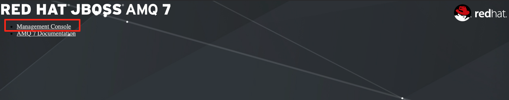
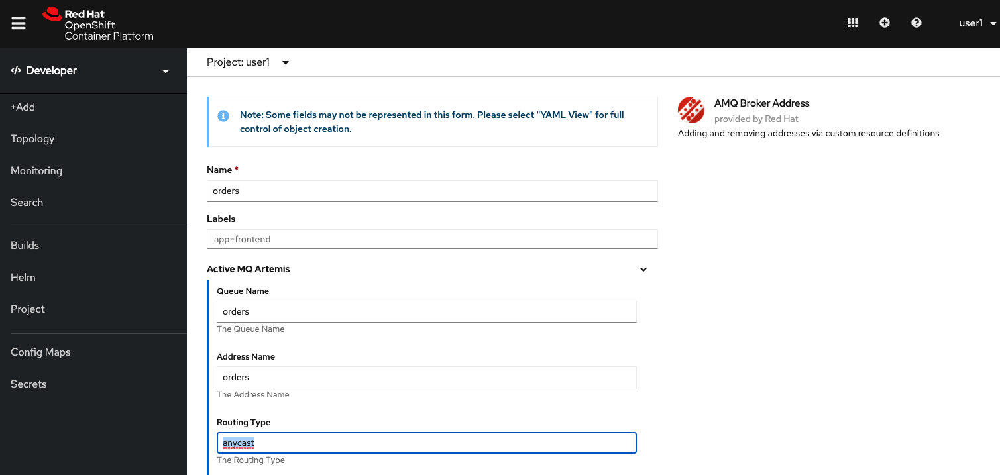
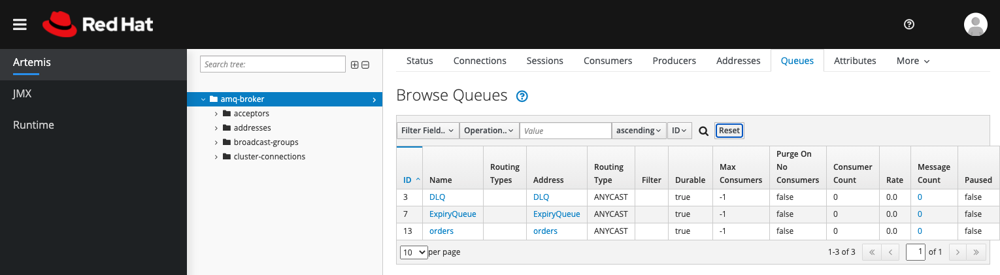
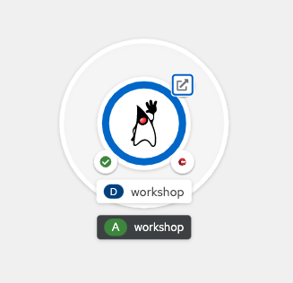

:walkthrough: Publish to Openshift
:codeready-url: {che-url}
:openshift-url: {openshift-host}
:user-password: openshift

= Lab 5 - Publish to OpenShift

Learn how to deploy integrations using the tools available for OpenShift.

There are several ways to deploy an application into OpenShift, the most common are:

- Directly from the git repository using S2I
- From the local machine using binary deployment
- From a Docker image

{empty} +

For this lab we will start with the binary deployment option, uploading the binary directly from the IDE workspace to OpenShift.
For it to work we will need the `oc` client that is installed in the environment.

In the last section you will see how to use S2I to deploy applications, a way to deploy application using git repositories.

[type=walkthroughResource,serviceName=codeready]
.CodeReady Workspaces
****
* link:{codeready-url}[Console, window="_blank"]
* link:https://developers.redhat.com/products/codeready-workspaces/overview[Want to know more about CodeReady Workspaces?, window="_blank"]
****

[type=walkthroughResource,serviceName=openshift]
.OpenShift Console
****
* link:{openshift-url}[Console, window="_blank"]
****

[type=walkthroughResource]
.OpenShift Maven Plugin
****
* link:https://www.eclipse.org/jkube/docs/openshift-maven-plugin[OpenShift Maven Plugin, window="_blank"]
****

[time=5]
== MySQL Database provisioning

First, to work with the MySQL database we have to deploy/provision it.

Go to the link:{openshift-host}[OpenShift Console, window="_blank"].
On the *Developer* view, click on *Add*  on the left menu:

image::./images/01.png[]

{empty} +

Click on *From Catalog*:

image::./images/02.png[]

{empty} +

Then look for *mysql* and select the *MySQL (Ephemeral)* option:

image::./images/03.png[]

{empty} +

Click on *Instantiate Template*:

{empty} +

Fill out *MySQL Connection Username*, *MySQL Connection Password* and *MySQL root user Password* as *redhat* and then click *Create*:

image::./images/05.png[]

{empty} +

[type=verification]
Were you able to deploy Mysql?

[time=5]
== AMQ provisioning

It's only required to cover this topic if you did the Lab 4 (Messaging with AMQ Broker). Let's provision an AMQ Broker on this step. On the *Developer* view, click on *Add* on the left side menu.
Select *Operator Backed* option. Filter by *AMQ Broker* and select the *AMQ Broker* tile:

image::./images/07.png[]

{empty} +

Click on *Create*:

image::./images/08.png[]

{empty} +

On the configuration select *YAML view* and paste the following content:

[source,yaml,subs="attributes+", id="amq-cr"]
----
apiVersion: broker.amq.io/v1beta1
kind: ActiveMQArtemis
metadata:
  name: amq-broker
  application: amq-broker
  namespace: {user-username}-project
spec:
  acceptors:
    - enabledProtocols: amqp
      name: amqp
      port: 5672
    - enabledProtocols: core
      name: core
      port: 61616
  addressSettings: {}
  adminPassword: redhat
  adminUser: redhat
  console:
    expose: true
  deploymentPlan:
    size: 1
    podSecurity: {}
    resources: {}
    readinessProbe: {}
    messageMigration: false
    extraMounts: {}
    managementRBACEnabled: true
    livenessProbe: {}
    journalType: nio
    image: placeholder
    storage: {}
  upgrades:
    enabled: false
    minor: false
----

{empty} +

image::./images/09.png[]

{empty} +

If everything worked fine, you should see a screen like this:

image::./images/10.png[]

{empty} +

Now, let's open the Management Console of the AMQ Broker.
On the left panel, click *Search*. On the resources dropbox, select `Route`:

image::./images/11.png[]

{empty} +

Click on the Route URL:

image::./images/12.png[]

{empty} +

Click on *Management Console*:

{empty} +

Enter the following credentials:

* Username: `redhat`
* Password: `redhat`

{empty} +

image::./images/14.png[]

{empty} +

This is AMQ Console main page. Click on the Queues tab.

image::./images/15.png[]

{empty} +

You may use this page to monitor the queues statistics.

image::./images/16.png[]

{empty} +

[type=verification]
Were you able to deploy AMQ?

{empty} +

As you can see the Address we need is not created. Follow theses steps to create it.
On the left panel, click *+Add* then *Operator Backed*:

{empty} +

Click *Create*:

image::./images/18.png[]

{empty} +

Set the *Queue Name* and *Address Name* as `orders`. Leave the *Routing Type* as `anycast`:

{empty} +

Now you will be able to visualize the queue using the web console:

{empty} +

[type=verification]
Were you able to deploy the new Queue?

[time=15]
== Application deployment to OpenShift using Binary Deployment

Before using the `oc` maven plugin, first we need to log in OpenShift.
On the right side panel, click on the `log in openshift` command:

image::./images/22.png[]

{empty} +

Once the login process is done, you should see a similar message:

image::./images/lab05-after-login.png[]

{empty} +

Now that you are logged in, on the right panel, click on the `deploy to openshift` command.
This command you build the project locally and push it to OpenShift, where a container image will be created.

image::./images/24.png[]

{empty} +

The `openshift` maven profile uses the k8s authentication configuration present in the user home.
It also uses a binary deployment, meaning it builds your application binary locally and sends the resulting jar to OpenShift to "wrap" in a container image and deploy it.

After the deployment completes, you will see that the application is using both the AMQ Broker / Kafka and the MySQL database deployed on OpenShift.
All production configuration data is in the `src/main/resources/application-prod.properties` file and Qiuarkus is activating this profile during the deployment.
oc will inject this content inside of the final DeploymentConfig when deploying to OpenShift.

[type=verification]
Were you able to deploy the Application?

[time=5]
== Application deployment on OpenShift using S2I

Binary deployment is effective when you are doing a lot of changes and do not want to push them to git in order to test the results.
When working in shared environments, we commonly use git as source of truth. To simplify this process you can deploy the code using Source-to-Image(s2i), a feature that abstracts the complexity of creating container images and sharing it.

Let's deploy the same application but using the S2I strategy.

In the *Developer View*, click *+ADD*, then select *From Git*.

{empty} +

Add the repository `https://github.com/hodrigohamalho/camel-workshop.git` and `labs-complete` as the branch reference.

image::./images/lab05-s2i-02.png[]

{empty} +

The interface will identify the correct language used by the project. Now set `openjdk-11-ubi8` as the Builder image and `workshop` as the *Application Name* and *Name*. Then click create.

{empty} +

On the build and deploy are done, you will be able to see the container and in the following image. You may try it by click on the Route button.

{empty} +

[type=verification]
Were you able to deploy the application?
