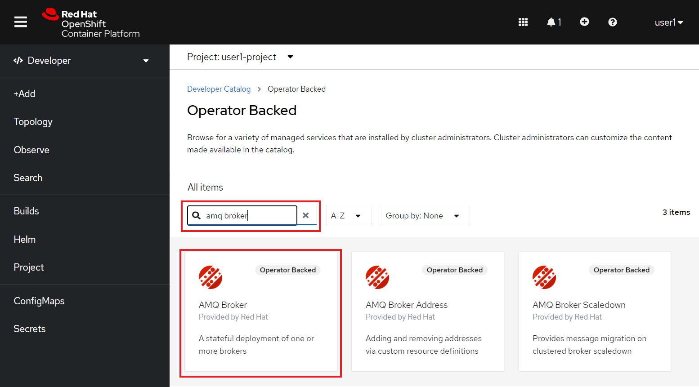
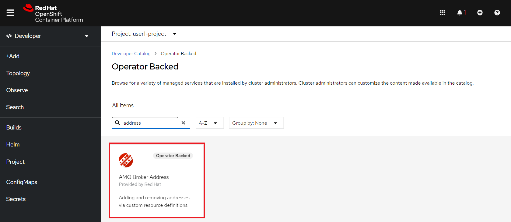

:walkthrough: Messaging with ActiveMQ Artemis
:codeready-url: {che-url}
:openshift-url: {openshift-host}
:user-password: openshift

= Lab 6 - Messaging with AMQ Broker (ActiveMQ Artemis)

Learn how to create routes that use asynchronous communication using message brokers(Red Hat AMQ Broker).

Asynchronous messaging helps to decouple applications.
Messaging makes the messaging system responsible for transferring data from one application to another, so the apps can focus on what data they need to share but not how that data is processed.

Let's create a RESTful endpoint that returns a quick response to the user, but do all the processing in the background. We are going to use the http://camel.apache.org/wiretap.html[wiretap] component to make a copy of the message in the Camel pipeline and post it in a JMS queue. After we recover from the queue and insert the order into the database, then notify the user by email.

Contents covered during this lab

* ActiveMQ component
* Producing and Consuming messages to a queue
* Use an embedded broker in the local environment

[type=walkthroughResource,serviceName=codeready]
.CodeReady Workspaces
****
* link:{codeready-url}[Console, window="_blank"]
* link:https://developers.redhat.com/products/codeready-workspaces/overview[Want to know more about CodeReady Workspaces?, window="_blank"]
****

[type=walkthroughResource,serviceName=openshift]
.OpenShift Console
****
* link:{openshift-url}[Console, window="_blank"]
****

Before jump into the code, let's prepare the Openshift environment installing the AMQ Broker (ActiveMQ Artemis).

[time=5]
== AMQ provisioning

It's only required to cover this topic if you did the Lab 4 (Messaging with AMQ Broker). Let's provision an AMQ Broker on this step. On the *Developer* view, click on *Add* on the left side menu.
Select *Operator Backed* option. Filter by *AMQ Broker* and select the *AMQ Broker* tile:

{empty} +

Click on *Create*:

image::./images/08.png[]

{empty} +

On the configuration select *YAML view* and paste the following content:

[source,yaml,subs="attributes+", id="amq-cr"]
----
apiVersion: broker.amq.io/v1beta1
kind: ActiveMQArtemis
metadata:
  name: amq-broker
  application: amq-broker
  namespace: {user-username}-project
spec:
  acceptors:
    - enabledProtocols: amqp
      name: amqp
      port: 5672
    - enabledProtocols: core
      name: core
      port: 61616
  addressSettings: {}
  adminPassword: redhat
  adminUser: redhat
  console:
    expose: true
  deploymentPlan:
    size: 1
    podSecurity: {}
    resources: {}
    readinessProbe: {}
    messageMigration: false
    extraMounts: {}
    managementRBACEnabled: true
    livenessProbe: {}
    journalType: nio
    image: placeholder
    storage: {}
  upgrades:
    enabled: false
    minor: false
----

{empty} +

image::./images/09.png[]

{empty} +

If everything worked fine, you should see a screen like this:

image::./images/10.png[]

{empty} +

Now, let's open the Management Console of the AMQ Broker.
On the left panel, click *Search*. On the resources dropbox, select `Route`:

image::./images/11.png[]

{empty} +

Click on the Route URL:

image::./images/12.png[]

{empty} +

Click on *Management Console*:

image::./images/13.png[]

{empty} +

Enter the following credentials:

* Username: `redhat`
* Password: `redhat`

{empty} +

image::./images/14.png[]

{empty} +

This is AMQ Console main page. Click on the Queues tab.

image::./images/15.png[]

{empty} +

You may use this page to monitor the queues statistics.

{empty} +

[type=verification]
Were you able to deploy AMQ?

{empty} +

As you can see the Address we need is not created. Follow theses steps to create it.
On the left panel, click *+Add* then *Operator Backed*:

image::./images/17.png[]

{empty} +

Click *Create*:

{empty} +

Set the *Queue Name* and *Address Name* as `orders`. Leave the *Routing Type* as `anycast`:

image::./images/20.png[]

{empty} +

Now you will be able to visualize the queue using the web console:

image::./images/21.png[]

{empty} +

[type=verification]
Were you able to deploy the new Queue?

[time=5]
== Async router

As we just did in the database session, let's start by uncommenting the `messaging` section in the `pom.xml`.

In `RestRouter.java`, set a simple text message to return in the body.

[source,java]
----
.post("/async")
    .consumes("application/json").type(Order.class).description("Create an order asynchronously")
    .route().routeId("create-order-async")
    .log("Async Order received")
    .setBody().simple("We received your request. As soon we process your request we will notify you by email.")
    .endRest();
----

{empty} +

Run the application and test it by calling the POST async method accessing the SwaggerUI page. Use the following body:

[source,javascript]
----
{
  "item": "Red Hat Integration",
  "amount": 10,
  "description": "Middleware Integration Portfolio",
  "processed": true
}
----

{empty} +

{empty} +

Now, let's *wiretap* the body to work with it asynchronously, while the Exchanged is still processed in the main route.

[source,java]
----
.post("/async")
    .consumes("application/json").type(Order.class).description("Create a new order")
    .route().routeId("create-order-async")
    .log("Order received")
    .wireTap("direct:create-order")
    .setBody().simple("We received your request. As soon we process your request we will notify you by email.")
    .endRest();

from("direct:create-order")
    .log("processing order async");
----

{empty} +

Save, and check the log to see if the new message *" processing order async "* appeared.

{empty} +

Now, instead of calling the SQL directly, let's send the order to a message broker:

[source,java]
----
from("direct:create-order")
    .log("sending ${body.item} to JMS queue")
    .to("jms:queue:orders");
----

{empty} +

Your code should looks like this:

{empty} +

Save the file and test the changes by calling the POST async method, by accessing the SwaggerUI page.

Check the logs to see the messages exchanged in the queue. As we are using an embedded broker to test our application without the need to deploy in any place, there isn't a web console.
Don't worry about it for now. When we deploy it on OpenShift, we'll use AMQ console.

{empty} +

[type=verification]
Do you see the message  *"processing order async"* in the logs when you create a new Order?

=== Consuming from Queues

Everything should be working fine. To simulate the entire flow, let's create another route in the same RouteBuilder, to consume from the queue and persist this information in the database. This new route could be another system consuming this message.
Remember that this kind of architecture aims to decouple applications from one another.

[source,java]
----
// Consume from the message broker queue
from("jms:queue:orders")
    .log("received ${body.item} from JMS queue")
    .to(this.insertOrder)
    .to("mock:notify-by-email");
----

{empty} +

Re-run the integration and look at the logs.

[type=verification]
Can you see the logs from the consumer route?

{empty} +

On the next section we are going to deploy the integration into OpenShift and we will be able to see all the messages passing through the AMQ via the AMQ Management Console.

[time=1]
== Summary

Congratulations you finished the Messaging lab.

We covered a lot of things during this lab. Here's a quick recap:

* How to interact with AMQ Broker (Artemis) using the **Artemis** Component
* How to run an **embedded Broker** in a local environment
* Working **asynchronously** with the **wireTap** Enterprise Integration Pattern
* Producing and Consuming messages

{empty} +

You can now proceed to `Openshift`.
